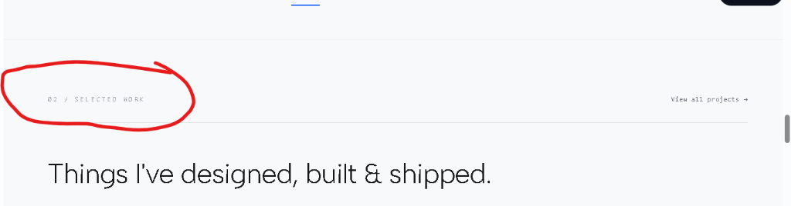

# Devender Gopagoni — Full-Stack Portfolio

> High-performance personal portfolio built with Next.js 14, TypeScript, Tailwind CSS, and GSAP motion physics.



## 🚀 Overview

A modern, interactive portfolio application showcasing full-stack web engineering, UI/UX design capabilities, and live SaaS/web projects. Features dynamic liquid cursor masks, 3D tilt motion physics, responsive slide-out navigation, and curated tech stack ecosystems.

## ✨ Features

- **Liquid Cursor Mask Hero**: Dual-layer canvas reveal effect with touch and pointer physics.
- **3D Tilt Project Showcase**: Interactive card perspective tilt and sheen sweep overlays.
- **Responsive Mobile Navigation**: Slide-out glassmorphism menu drawer with smooth scroll anchors.
- **Core Tech Stack Grid**: Interactive developer illustration with levitating core technology badges.
- **Services & Deliverables Checklist**: Highlighting capabilities across Frontend, Backend, CMS, and AI/Automation.
- **Privacy-Focused Contact**: Direct email inquiry CTAs and official social media brand badges (GitHub, LinkedIn, Connects AI).

## 🛠️ Tech Stack

- **Framework**: [Next.js 14](https://nextjs.org/) (App Router)
- **Language**: [TypeScript](https://www.typescriptlang.org/)
- **Styling**: [Tailwind CSS](https://tailwindcss.com/)
- **Animations**: [GSAP](https://greensock.com/gsap/) & [Lenis Smooth Scroll](https://lenis.darkroom.engineering/)
- **Icons**: Lucide React & Official Brand SVGs

## 📦 Getting Started

First, install dependencies and run the development server:

```bash
npm install
npm run dev
```

Open [http://localhost:3000](http://localhost:3000) with your browser to see the result.

## 🔨 Production Build

To test the production build locally:

```bash
npm run build
npm run start
```

## 📬 Contact & Socials

- **Email**: [devendhargopagoni@gmail.com](mailto:devendhargopagoni@gmail.com)
- **GitHub**: [@devendharoff](https://github.com/devendharoff)
- **LinkedIn**: [Devender Goud](https://www.linkedin.com/in/devender-goud-033875338/)
- **Connects AI**: [@connects.ai](https://www.instagram.com/connects.ai)

---
© 2026 Devender. All rights reserved.
